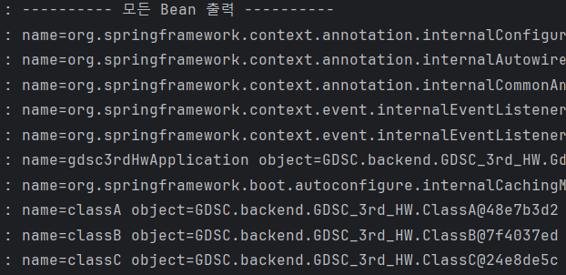
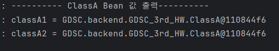

### 1.Spring Bean이란 무엇인가?

Spring Bean이란 스프링 IoC 컨테이너에 의해 관리되는 자바 객체이다. 이때 스프링 IoC 컨테이너도 객체이다.
Spring은 Spring Bean을 통해 의존성 문제를 해결하여 객체간 **유연성**을 확보한다.

##### 빈스코프
: Spring은 빈이 생성되고 존재하고 적용되는 범위를 지정할 수 있다. 이런 빈의 스코프는 @Scope annotation을 이용하여 지정한다.

Spring은 다음과 같은 다양한 스코프를 지원한다.
- 싱글톤 : 기본 스코프, 스프링 컨테이너의 시작과 종료까지 유지되는 가장 넓은 범위의 스코프
    - 싱글톤의 문제점
        1. private 사용으로 인한 상속 불가능 → 다형성X
        2. 싱글톤 패턴으로 구현된 객체는 공유객체이므로 단위테스트가 어려움
        3. 클라이언트가 구체 클래스에 의존함 → DIP, OCP 위반
        4. 내부 속성을 변경하기 어려움
- 프로토타입 : 스프링 컨테이너는 프로토타입 빈의 생성과 의존관계 주입까지만 관여하고 더는 관리하지 않는 매우 짧은 범위의 스코프
- 웹 관련 스코프
    - request : 웹 요청이 들어오고 나갈때 까지 유지되는 스코프
    - session : 웹 세션이 생성되고 종료될 때 까지 유지되는 스코프
    - application : 웹의 서블릿 컨텍스트와 같은 범위로 유지되는 스코프

##### 빈 관리

Spring은 Ioc 컨테이너를 사용하여 애플리케이션이 시작 될 때, 인스턴스를 메모리에 딱 하나 할당하고, 뒤의 호출 시 마다 해당 인스턴스를 반환하여 싱글톤 패턴의 단점을 극복한다.

1. 객체 생성 + property 설정
Spring IoC 컨테이너가 생성이 되면 빈 스코프가 싱글톤인 객체를 생성한다. 빈을 생성할 때는 평범한 자바 클래스를 이용하여 객체를 생성한다. (빈의 상태를 항상 예측할 수 없기 때문에 싱글톤 스코프의 빈이 상태를 가지면 안된다. )

2. 의존 설정
빈 객체가 생성이 되면 IoC 컨테이너는 의존 설정을 한다. 이때 의존성 자동 주입이 일어나게 된다. ( 의존성을 자동 주입해야할 인터페이스의 구현체가 두 개 이상이라면 Spring은 어떤 구현체를 자동 주입할 지 정하지 못해서 충돌이 일어나게 된다. Primary, Qualifier 등의 annotation을 통해 우선순위를 정하면 이 문제를 해결할 수 있다. )

3. 객체 초기화 → 사용 → 소멸
모든 객체가 다 초기화가 필요한 것은 아니지만 사용 전에 초기화 과정이 필요한 객체들은 초기화 과정을 진행한다. 스프링 컨테이너가 종료될 때 빈 스코프가 싱글톤인 객체들도 함께 소멸된다.

*** 
### 2.Spring Bean을 등록하는 방법을 정리하라

**@Component**
Sping bean 으로 등록하려는 클래스에 붙일 수 있는 annotation. Spring은 이 annotation이 붙은 클래스를 자동으로 검색하고 빈으로 등록한다.

**Component Scan**
스프링이 애플리케이션의 클래스를 검색하고, 자동으로 스프링 빈을 등록하는 방법. @ComponentScan annotation을 사용하여 스프링이 어느 패키지에서 클래스 검색을 시작할지 및 검색할 패키지의 범위를 설정할 수 있다. 기본적으로 @ComponentScan 이 붙은 설정 정보 클래스의 패키지가 시작 위치가 된다.

**@Configuration**
@Configuration annotation을 사용하면, 스프링이 바이트 코드를 조작해서 싱글톤이 보장될 수 있게 다른 객체를 생성해서 저장한다.

*@Configuration, @Service, @Controller, @Repository 또한 @Component annotation이 있어 Component Scan 대상이다.*

***
### 3. 프로그램 로그

