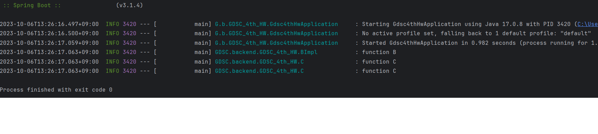

### 1. 의존성 주입

##### 1.1 의존성 주입 (DI ; Dependency Injection)
DI : 외부에서 두 객체 간의 관계를 결정해주는 디자인 패턴
- 인터페이스를 사용하여 클래스 레벨에서는 의존관계가 고정되지 않도록 한다.
- 런타임 시 관계를 동적으로 주입하여 유연성↑ 결합도↓
- 가장 자주 쓰는 어노테이션은 **@Autowired**로, Spring이 자동으로 해당 클래스의 객체를 찾아서 필요한 의존성을 주입한다. 
이때 해당 클래스의 객체도 Spring Bean 이어야한다.

##### 1.2 의존성 주입 방법

###### 1.2.1 생성자 주입
생성자를 통해 의존 관계를 주입하는 방법으로, 객체의 최초 생성 시점에 Spring이 의존성을 주입해준다.
주입받은 객체가 변하지 않거나, 반드시 객체의 주입이 필요한 경우에 강제하기 위해 사용할 수 있다. 
생성자가 단 1개일 경우 @Autowired 를 생략해도 주입이 가능하며 @Autowired 가 붙은 생성자가 여러 개 있을 경우 가장 많은 의존성을 주입할 수 있는 생성자를 사용하여 의존성 주입한다.

###### 1.2.2 수정자 주입(setter 주입)
setter라 불리는 수정자 메서드를 통해 의존관계를 주입하는 방법으로, setter 메서드에 @Autowired 어노테이션을 붙이면 Spring이 setter를 사용해 알아서 의존성 주입해준다.
파이널 필드(초기값이 저장되면 변경불가능)를 만들 수 없고 의존성의 선택/변경 가능성이 있는 의존관계에 사용할 수 있다.
빈 객체를 만들고 setter로 의존성 주입하므로 빈 생성자가 필요하다.

###### 1.2.3 필드 주입
수동 의존성을 주입할 수 없어 더이상 추천되지 않는 방법이다.

###### 1.2.4 일반 메서드 주입
한번에 여러 필드를 주입 받을 수 있지만 일반적으로 잘 쓰지 않는다.

##### 1.3 의존성 주입의 의의
- 클래스간의 결합도가 약해져, 리펙토링이 쉬워진다.
- 클래스간의 결합도가 약해져 특정 클래스를 테스트하기가 편해진다.
- 인터페이스 기반 설계는 코드를 유연하게 한다. 확장을 쉽게 한다.
- UI가 있는 프로그램에서는 생명 주기가 중요한데, 생명주기 별로 Container를 관리할 수 있게 된다면 리소스의 낭비를 막을 수 있다.

##### 1.4 주의점

###### 1.4.1 NullPointerException 방지
수정자 주입/필드 주입의 경우 스프링의 빈 관리 기능을 빌리지 않고 new 키워드로 객체를 생성해 줄 경우, NullPointerException이 발생할 수 있다.
왜냐면 이들은 빈 생성자를 사용해 기본적으로 의존성이 없는 상태이기 때문이다. 하지만 생성자 주입은 (완전한 생성자라는 가정 하에) 객체 생성 시점에 모든 의존성을 주입해주므로 Null을 의도적으로 넣어주지 않는 한 NullPointerException이 발생할 수 없다. 

###### 1.4.2 순환참조 문제 방지
필드 주입이나 setter 주입을 통해 의존성을 주입하게 되면, A 객체가 B 객체를 의존하는데 B 객체 또한 A 객체를 의존할 때 생기는 순환참조가 발생할 수 있다. 그러나 생성자 주입을 사용하는 객체들끼리 의존성이 순환되면 스택오버플로우가 발생해서 프로그램이 멈추게 될 것이다. 
*스택오버플로우: 지정한 스택 메모리 사이즈보다 더 많은 스택 메모리를 사용하게 되어 에러가 발생하는 상황*

##### 1.5 주입 순서
주입대상이 여러개일 때 순서대로 **타입 , @Qualifier , @Primary , 변수명**에 따라 의존성 주입을 한다.
@Qualifier 어노테이션 안에 해당 Bean의 구분자를 지정해줄 수 있다. 
@Primary 어노테이션이 붙은 Bean은 해당 타입으로 의존성 검색을 할 때 우선적으로 주입된다.

##### 1.6 Lombok
Lombok은 Java 라이브러리로, 반복적인 코드를 줄이는 데 도움을 주는 어노테이션 기반의 도구를 제공해준다.

Lombok이 제공해주는 생성자
- @NoArgsConstructor : 파라미터가 없는 기본 생성자를 생성
- @RequiredArgsConstructor : final 또는 @NonNull로 표시된 필드만을 파라미터로 하는 생성자를 생성
- @AllArgsConstructor : 모든 필드 값을 파라미터로 받는 생성자를 생성

***
### 2. Springboot

##### 2.1 Spring Boot

Spring Boot는 Spring 기반의 어플리케이션를 빠르게 개발하고 실행하기 위한 프레임워크로 개발 저항을 줄이고 JAVA의 경량화를 위해 만들어졌다.
개발에 필요한 복잡한 설정을 Spring Boot가 대신 해줌으로써, 개발자의 편리한 Spring 사용에 도움을 준다.

##### 2.2 Spring Boot의 특징
1. WAS, Tomcat 같은 웹 서버를 내장해서 별도의 웹 서버를 설치하지 않아도 됨
2. 라이브러리 관리 손쉬운 빌드 구성을 위한 스타터 종속성 제공 및 라이브러리 버전 관리
3. 자동 구성 프로젝트 시작에 필요한 스프링과 외부 라이브러리의 빈을 자동 등록 스프링 애플리케이션에 공통으로 필요한 애플리케이션 기능을 자동으로 구성
4. 외부 설정 환경에 따라 달라져야 하는 외부 설정 공통화
5. 프로덕션 준비
- 스프링 애플리케이션 컨텍스트에 구성된 빈
- 스프링 부트의 자동 구성으로 구성된 것
- 애플리케이션에서 사용할 수 있는 환경 변수, 시스템 프로퍼티, 구성 프로퍼티, 명령줄 인자
- 메모리 사용량, 가비지 컬렉션, 웹 요청, 데이터 소스 사용량 등 다양한 메트릭
6. 독립적으로 실행 가능한 Jar 파일로 프로젝트를 빌드할 수 있어, 클라우드 서비스 및 도커와 같은 가상화 환경에 빠르게 배포 가능

***
### 3. 프로그램 로그
