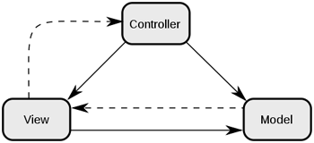
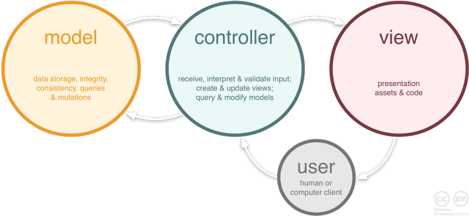

MVC란?

### 1. MVC (Model-View-Controller)
: 하나의 애플리케이션을 구성할 때 그 구성요소를 세가지의 역할(데이터 처리, 사용자 인터페이스, 제어 로직)로 구분한 패턴
웹 어플리케이션과 그 외의 사용자 인터페이스를 가진 어플리케이션을 설계할 때 사용된다.

작동 순서: 사용자가 controller를 조작 → controller는 model을 통해서 데이터를 가져옴 → 데이터를 바탕으로 시각적인 표현을 담당하는 View를 제어해서 사용자에게 전달.

##### 1.1 Model : 데이터 및 비즈니스 로직을 처리
- 데이터베이스와의 상호 작용, 쿼리 실행, 데이터 저장 및 조회와 같은 기본적인 작업을 포함한다.
- 변경이 발생하면, 관련된 View에 알릴 수 있다.
**비즈니스 로직 : 업무에 필요한 데이터 처리를 수행하는 응용 프로그램의 일부*

##### 1.2 View : UI 부분
- 데이터를 표시하거나 사용자와 상호작용을 위한 인터페이스를 표시한다.
- View 생성 규칙
    1. 모델이 가지고 있는 정보를 (임의의 뷰 내부에) 따로 저장해서는 안된다.

    2. 모델이나 컨트롤러와 같이 다른 구성요소들이 어떻게 동작하는지 알면 안된다.

    3. 변경이 일어나면 변경통지에 대한 처리방법을 구현해야만 한다.

##### 1.3 Controller (Model과 View 사이의 중개자)
- 클라이언트의 요청에 대해 실제 업무를 수행하는 Model 컴포넌트를 호출하고, 그 결과를 View에 전달하는 다리역할. 즉, 사용자가 데이터를 클릭하고, 수정하는 것에 대한 "이벤트"들을 처리하는 부분을 뜻합니다. 

- Controller 생성 규칙
    1. 모델이나 뷰에 대해서 알고 있어야 한다.
    2. 모델이나 뷰의 변경을 모니터링 해야 한다.

***

### 2. MVC의 장점
- 분리 및 재사용 : 각 컴포넌트는 독립적이기 때문에 다른 부분에 영향을 주지 않고 수정하거나 재사용할 수 있다.
- 유지 보수 : 변경이 필요한 경우, 해당하는 컴포넌트만을 수정하면 되므로 유지 보수가 용이하다.
- 확장성 : 새로운 기능이나 로직을 추가하기 쉽다.